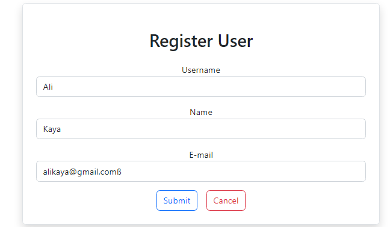
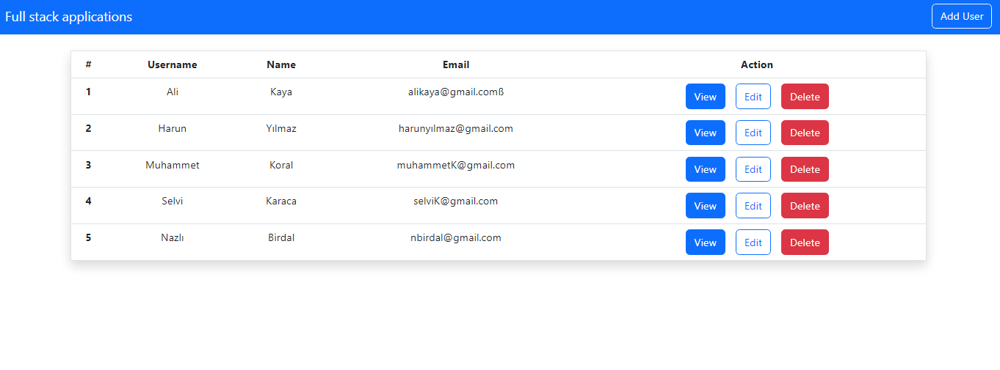
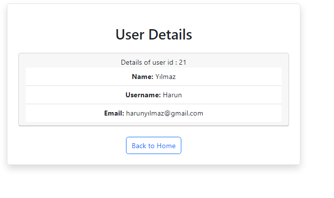

## User crud project
- kulanıcı için ekleme ,silme ve okuma fonksiyonları yapılmıştır backend için spring boot ,frontend için ise react.js kullanılmıştır.  

Backend linki aşağıdadır:

[Backend-Link](https://github.com/Fettah-Koral/UserCrudBackend)

 

Kullanıcı ekleme :

Kullanıcıları listeleme:

Kullanıcı detayını görüntüleme:

